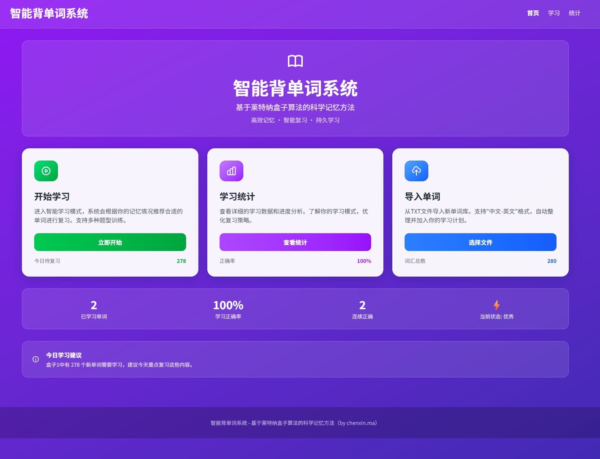

# 智能英语学习系统

一个基于 React + Vite 构建的智能英语学习应用，采用莱特纳间隔重复系统帮助用户高效学习英语单词。



## 功能特性

### 🎯 多种学习模式
- **配对练习** - 中英文单词配对，加深记忆
- **填空练习** - 根据中文释义和字母提示拼写英文单词
- **翻译练习** - 英文单词翻译成中文，支持同义词识别

### ✨ 游戏化激励系统
- **连胜机制** - 连续每日学习获得额外经验倍数奖励  
  - 1-3天: 1x经验 | 4-7天: 1.5x经验 | 8+天: 2x经验
- **等级成长** - 积累经验值提升等级，见证学习历程
  - 每1000经验升一级，实时追踪学习成果
- **成就系统** - 完成学习目标解锁丰富徽章
  - 🎯 新手上路 | 🔥 火热状态 | 📚 词汇大师 | ✅ 完美表现 | 🏆 坚持不懈
- **实时通知** - 关键里程碑自动提醒，提升学习乐趣

### 📚 智能学习系统
- **莱特纳系统** - 科学间隔重复算法，根据记忆曲线优化复习间隔
- **自适应学习** - 根据用户的答题情况自动调整单词出现的频率
- **深度学习语义理解** - 使用 bge-small-zh-v1.5 模型提供智能中文翻译评估
- **学习统计** - 实时追踪学习进度和正确率

### 💾 数据管理
- **本地存储** - 学习数据自动保存在浏览器本地
- **单词导入** - 支持从文件导入单词库
- **进度追踪** - 详细记录每个单词的学习状态

导入格式，每个单词占一行，格式为 `中文单词	英文单词`，分隔符为制表符 `\t`
```text
追赶	chase
选择	choose
中国	China
教	teach
指示；命令 n.	instruction
实验；试验 n.	experiment
活动（单数-复数） n.	activity; activities
社团 n.	club / society
书法 n.	calligraphy
加入 v.	join
```

### 🧠 深度学习特性
- **语义相似度计算** - 基于深度学习的语义向量空间比较
- **智能同义词识别** - 不仅识别字面相同，更能理解语义相近
- **浏览器端深度学习** - 使用 WebAssembly 提供高性能的模型推理
- **智能缓存系统** - 模型和语义向量双重缓存，提高响应速度
- **容错机制** - 模型加载失败时自动降级为字符串匹配

## 技术栈

- **前端框架**: React 19.2.0
- **构建工具**: Vite 7.2.4
- **路由管理**: React Router DOM 7.12.0
- **样式框架**: Tailwind CSS 4.1.18
- **数据可视化**: Chart.js 4.5.1
- **状态管理**: React Context API
- **语义理解**: @huggingface/transformers 3.13.0
- **深度学习模型**: bge-small-zh-v1.5 (浏览器端部署)

## 项目结构

```
src/
├── components/           # 组件目录
│   ├── Quiz/            # 测验组件
│   │   ├── FillInQuiz.jsx      # 填空题组件
│   │   ├── MatchingQuiz.jsx    # 配对题组件
│   │   └── TranslationQuiz.jsx # 翻译题组件
│   ├── Cards/           # 卡片组件
│   └── Layout/          # 布局组件
├── contexts/            # React Context
│   └── AppContext.jsx   # 应用全局状态管理
├── core/               # 核心业务逻辑
│   ├── leitnerBox.js   # 莱特纳系统实现
│   ├── wordManager.js  # 单词管理
│   └── quizEngine.js   # 测验引擎
├── io/                 # 输入输出处理
│   ├── fileReader.js   # 文件读取
│   └── webStorage.js   # 本地存储
├── models/             # 数据模型
│   └── word.js        # 单词模型
├── pages/              # 页面组件
│   ├── Home.jsx       # 首页
│   ├── Learning.jsx   # 学习页面
│   └── Statistics.jsx # 统计页面
├── services/           # 服务层
│   ├── webLeitnerBox.js
│   ├── webQuizEngine.js
│   ├── webWordManager.js
│   └── chineseSemanticService.js  # 中文语义理解服务（深度学习）
```

## 核心算法

### 莱特纳间隔重复系统
- 5个记忆盒子，根据用户的答题情况自动调整单词位置
- 答对则升级到下一个盒子，答错则降级
- 不同盒子的单词有不同的复习间隔：
  - 盒子1：每日复习
  - 盒子2：每2天复习
  - 盒子3：每周复习
  - 盒子4：每两周复习
  - 盒子5：每月复习

### 智能测验引擎
- 支持多种测验类型，自动生成题目
- **深度学习语义理解** - 使用 bge-small-zh-v1.5 模型提供智能中文翻译评估
- 智能答案匹配，支持同义词识别
- 详细的答题数据记录（尝试次数、提示使用、答题时间等）

## 快速开始

### 安装依赖
```bash
npm install
```

### 启动开发服务器
```bash
npm run dev
```

### 构建生产版本
```bash
npm run build
```

### 预览生产版本
```bash
npm run preview
```

### 代码检查
```bash
npm run lint
```

## 使用指南

1. **导入单词库**
   - 支持文本文件导入，每行一个单词，格式为：`英文 单词 中文释义`
   
2. **开始学习**
   - 选择喜欢的学习模式
   - 系统会根据你的学习进度自动安排单词
   
3. **查看统计**
   - 实时查看学习进度、正确率等数据
   - 了解自己的学习强项和弱项

## 浏览器兼容性

- Chrome (推荐)
- Firefox
- Safari
- Edge

## 开发说明

### 使用语义服务

#### 1. 基础使用示例
```javascript
import chineseSemanticService from './services/chineseSemanticService';

// 等待模型加载完成
while (!chineseSemanticService.isReady()) {
  await new Promise(resolve => setTimeout(resolve, 100));
}

// 比较两个中文文本的语义相似度
const similarity = await chineseSemanticService.compareSimilarity(
  "这是一个测试", 
  "这是一个试验"
);

console.log('语义相似度:', similarity); // 输出 0-1 之间的数值
```

#### 2. 在 React 组件中使用
```javascript
useEffect(() => {
  const checkModelReady = async () => {
    while (!chineseSemanticService.isReady()) {
      await new Promise(resolve => setTimeout(resolve, 500));
    }
    // 模型已加载，可以使用
  };
  
  checkModelReady();
}, []);
```

#### 3. 获取文本向量
```javascript
const vector = await chineseSemanticService.getTextEmbedding('你好，世界');
console.log('文本向量:', vector); // 768维向量
```

### 添加新的测验类型
1. 在 `src/core/quizEngine.js` 中添加新的测验生成方法
2. 在 `src/components/Quiz/` 目录下创建新的测验组件
3. 在 `src/pages/Learning.jsx` 中注册新的测验组件
4. 如果需要语义理解功能，可以在组件中使用 chineseSemanticService

### 自定义单词格式
可以在 `src/models/word.js` 中修改单词数据模型，支持更丰富的单词属性。

### 模型配置
在 `src/services/chineseSemanticService.js` 中可以修改模型配置：
```javascript
env.setOptions({
  cacheDir: './models',      // 模型缓存目录
  allowRemoteModels: false,  // 是否允许远程模型
  allowLocalModels: true     // 是否允许本地模型
});
```

## 贡献指南

1. Fork 本项目
2. 创建特性分支 (`git checkout -b feature/AmazingFeature`)
3. 提交更改 (`git commit -m 'Add some AmazingFeature'`)
4. 推送到分支 (`git push origin feature/AmazingFeature`)
5. 开启 Pull Request

## 许可证

本项目采用 MIT 许可证 - 查看 [LICENSE](LICENSE) 文件了解详情。

## 联系方式

如有问题或建议，请提交 Issue 或 Pull Request。